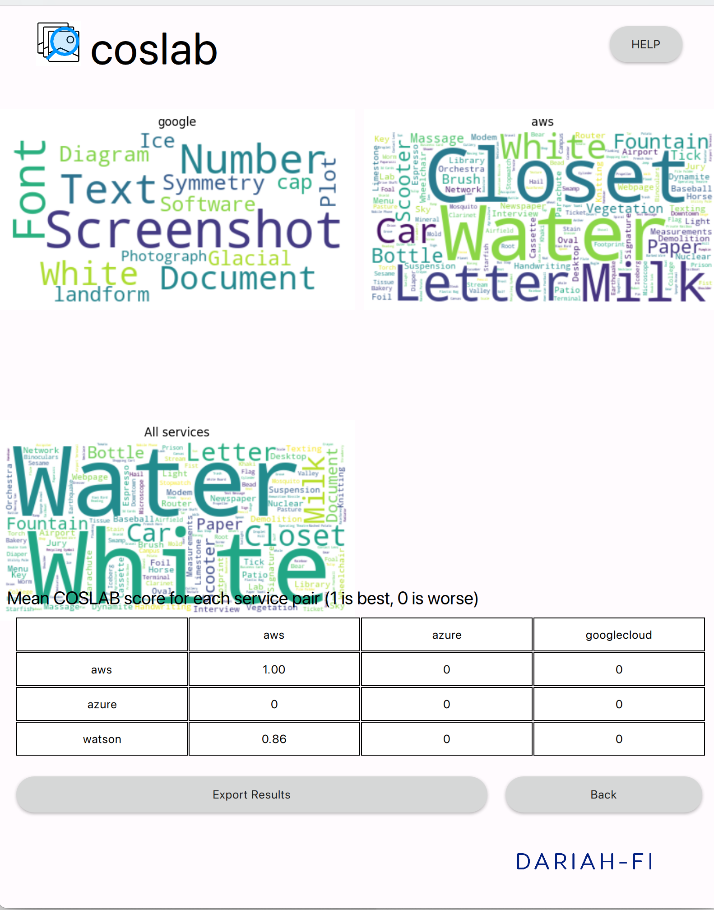

# Graphical user interface for cross-service label agreement score

There are various image recognition tools, which label images based on their content.
However, these services often provide different number of labels for each image, and more critically, different labels.
For example, Google Vision and Microsoft Azure provide somewhat different labels for this image:

Google sees the image as: Daytime, Sky, City, Public Space, Human Settlement, Road, Residential Area, Urban Area, Asphalt, Metropolitan Area, Tree, Infrastructure, Park, Road Surface, Downtown, Architecture, Neighbourhood, Skyline, Real Estate, Thoroughfare, Building, Suburb, Urban Design, Street, Lane, Walkway, Cloud, Recreation, Plaza, Town Square, Sidewalk, Nonbuilding, Structure,

while Azure sees the image as:

Outdoor, Road, Street, City, Grass, Sitting, Empty, Red, View, Side, Stop, Green, Traffic, Sign, Track, Yellow, Park, Tall, Bench, Parked, Train, Hydrant, Riding, Bus

There are some perfect matches, such as Road, Park and City,
but also some close calls where it appears that both services see a similar object, but just see articulate them differently.
For example, Google Vision sees a lane or a Walkway, which are not that different from Azure's Road and Street.
And then there are labels where it is obvious that _interservice reliability_ - similar to intercoder reliability among human annotators - would be low:
Azure's Bus and Train do not a close counterpart in Google Vision labels.

We developed the cross-service label agreement score (COSLAB) to avaluate the similarity across services to allow for more reliable use of image recognition tools in social science research.
The score uses natural language processing to measure how similarly two terms are used in written language (from 0-1) and using these cosine similarities, determines the best match for each label across other services.

This tool allows you to use a drag-and-drop tool for the COSLAB measurement tool [(Berg & Nelimarkka, 2023)](https://asistdl.onlinelibrary.wiley.com/doi/full/10.1002/asi.24827) to label image content and assess across image recognition services and calculate the overall quality of these labels.

## Step-by-step user guide

Add images you wish to analyse either by dragging and dropping them to the user interface or through the "Add images" button.
When ready, click analyse images to move to the next step.
If you accidentally add images not meant for analysis, you can remove them through the trash icon.

On Step 2, you need to choose image recognition services used for the analysis.
For the first time you use each service, you need to provide specific details to use these application programming interfaces, entered the boxes shown when the service is selected.
The system stores this information automatically.

After clicking analyse images, the software **might become unresponsible** as data analysis is conducted.
Once ready, you are shown an overview of the results:
word clouds for labels on each service, a summary matrix showing how well services observed same themes, 1 indicating a perfect match and 0 indicating no match at all.
This is calculated using the cosine similarities per [Berg & Nelimarkka (2023)](https://asistdl.onlinelibrary.wiley.com/doi/full/10.1002/asi.24827).
You can also expert the word clouds and image labelling agreements for each service.

Exporting CSV or Excel files gives you access to service provided labels for each image.
In addition, it includes service indicated confidence score as well as our calculated COSLAB scores across services.
For example, in the column `coslab-aws` the current service, label -pair is contrasted with all labels provided by Amazon Web Services.

## Acknowledgements

Software developed by

* Leonardo Negri
* Matti Nelimarkka

Development funded by the [DARIAH-FI infrastructure](https://www.dariah.fi/), funding decision Research Council of Finland 35872 and C. V. Åkerlund foundation.

## References

* [Berg, A., & Nelimarkka, M. (2023). Do you see what I see? Measuring the 
semantic differences in image‐recognition services' outputs. _Journal of 
the Association for Information Science and 
Technology._](https://asistdl.onlinelibrary.wiley.com/doi/full/10.1002/asi.24827)
* [Nelimarkka, M., & Berg, A. (2023). Is the World Different Depending on 
Whose AI Is Looking at It? Comparing Image Recognition Services for Social 
Science Research. _Information Matters_, 
3(8).](https://informationmatters.org/2023/08/is-the-world-different-depending-on-whose-ai-is-looking-at-it-comparing-image-recognition-services-for-social-science-research/) 